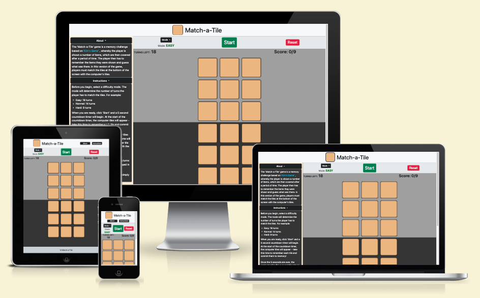
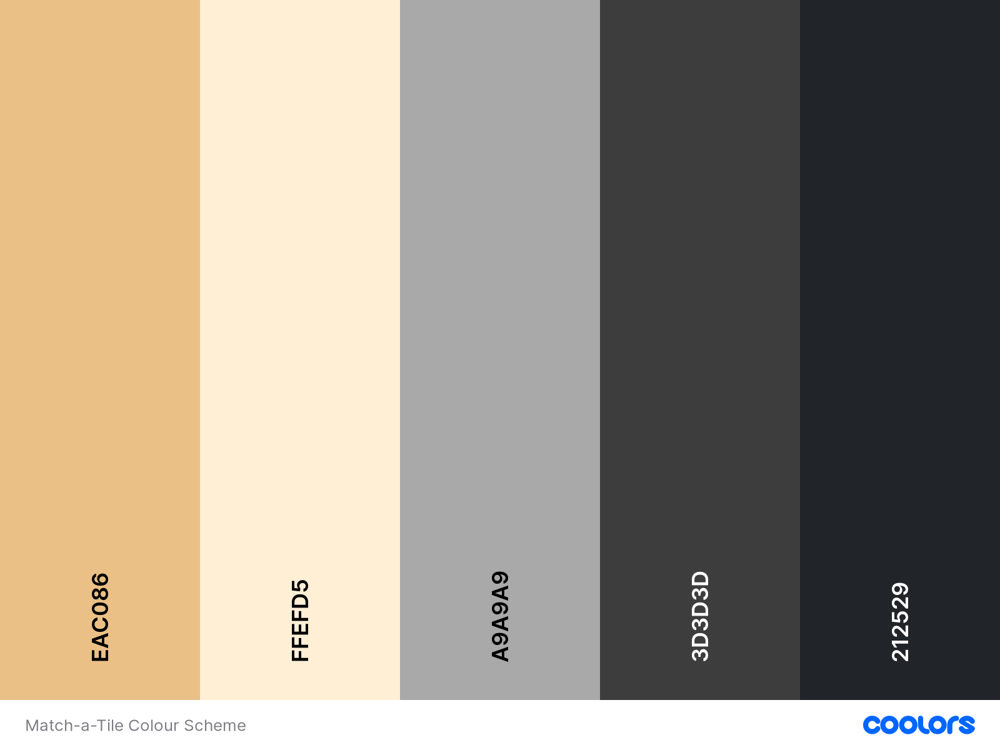
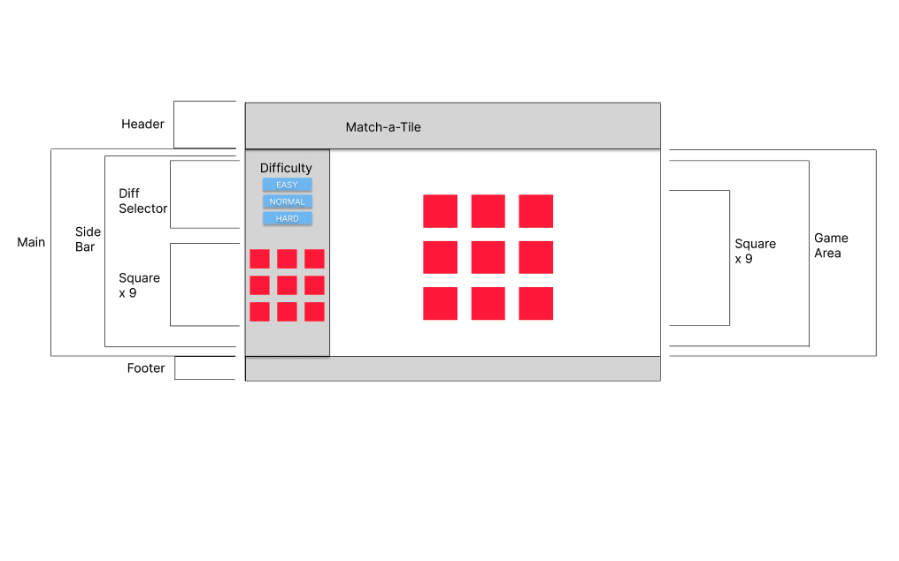
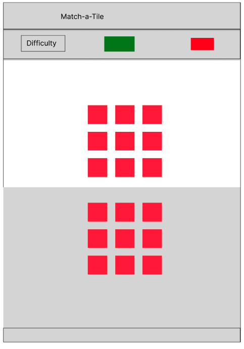
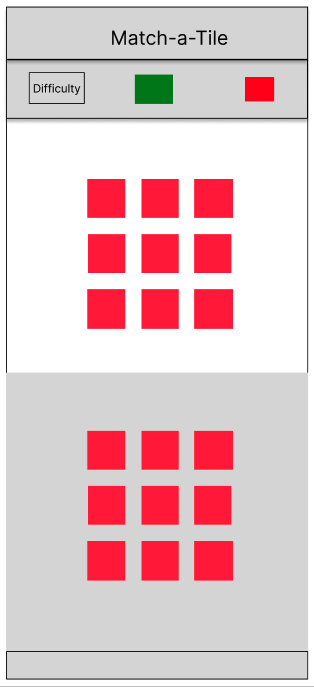

# Match-a-Tile

The 'Match-a-Tile' game is a memory challenge based on 'Kim's Game' , whereby the player is shown a number of items, which are then covered after a period of time. The player then has to remember the items they were shown and guess what was there. In this version of the game, players must match the tiles at the bottom of the screen with the computer's tiles.

The primary goal of this project is to offer the user a fun and interactive game to play while, at the same time, provide a challenge to test the user's memory.

Visit the deployed site [here](https://danhodgson12.github.io/Match-a-Tile/).

---

# User Experience (UX)

## Project Goals

- The game can be easily navigated and understood.
- Clearly explains the concept of the game.
- Clearly explains how to play the game.
- Contains clear imagery and content.
- Provides interactivity in the form of clickable elements.
- Provides feedback in the form of elements changing state.
- Provides a score system and conveys it clearly.
- Provides feedback in the form of displaying how many turns the player has left.
- Offers the user the ability to challenge their memory skills.
- The game can be played on a variety of screen sizes.

## User Stories

- As a user, I want to be able to navigate the game easily.
- As a user, I want to know what the game is about.
- As a user, I want to know how to play the game.
- as a user, I want to see the images clearly.
- As a user, I want to be able to interact with the game.
- As a user, I want to be given feedback when I interact with the game.
- As a user, I want to be able to see my score.
- As a user, I want to know how many turns I have left.
- As a user, I want to challenge my momery skills.
- As a user, I want to play the game on a variety of screen sizes.

## Colour Scheme

The colours used for this website are:

- Sunset (#EAC086) - for the computer & player tiles and the navbar logo. This colour is loosely based on the color for the [Scrabble](https://en.wikipedia.org/wiki/Scrabble) tile.
- Papaya Whip (#FFEFD5) - for the side bar.
- Silver (#A9A9A9) - for the computer-tiles background
- Onyx (#3D3D3D) - for the player-tiles background.
- Eerie Black (#212529) - for the Mode-selection, About and Instructions buttons.

## Typography

The font used throughout this project is the sans-serif font that loads as standard depending on browser choice. The reason for this is that I wanted to keep the styling basic and focus more on the functionality of the game. Also, I like how the standard font looks and feel it goes well with the styling of the images for the tiles.

## Wireframes

[Figma](https://www.figma.com/) was used to showcase the visuals of the game across the three main screen sizes.

The full version of wireframes can be viewed [here](https://www.figma.com/file/FKLPRejh6ElgwCStCXU0IF/Match-a-Tile-WireFrames?type=design&node-id=0-1&mode=design&t=1RPCNTWt2wE6rDEL-0).

Device | Wireframe
--- | ---
Desktop | 
Tablet | 
Phone | 

# Features

# Technologies Used

## Languages

- [HTML](https://en.wikipedia.org/wiki/HTML)
- [CSS](https://en.wikipedia.org/wiki/CSS)
- [JavaScript](https://en.wikipedia.org/wiki/JavaScript)

## Frameworks, Libraries & Programs

- [Font Awesome](https://fontawesome.com/)
  - Font Awesome was used to add icons/images to the computer and player tiles.

- [Codeanywhere](https://app.codeanywhere.com/)
  - Codeanywhere was used for writing, committing and pushing the code to GitHub.

- [Bootstrap 5](https://getbootstrap.com/)
  - Bootstrap 5 was used to develop a responsive mobile-first design using an assortment of templates.

- [jQuery](https://jquery.com/)
  - jQuery was used as the preferred JavaScript library for HTML document traversal and manipulation, event handling and animation.

- [Chrome DevTools](https://developer.chrome.com/docs/devtools/)
  - Chrome DevTools was used throughout the development of the website to test ideas and responsiveness, as well as test functionality of the game and debug issues that arose.

- [W3C Markup Validator](https://validator.w3.org/)
  - W3C Markup Validator was used to validate the HTML code.

- [W3C CSS Validator](https://jigsaw.w3.org/css-validator/)
  - W3C CSS Validator was used to validate the CSS code.

- [JSLint](https://www.jslint.com/)
  - JSLint was used to validate the JavaScript.

- [Favicon.io](https://favicon.io/)
  - Favicon.io was used to create the site favicon.

# Testing

## Testing User Stories

## Code Validation

## Lighthouse Report

### Home Page

### Gallery Page

### Contact Us Page

## Tools Testing

## Manual Testing

### Browser Compatibility
  
### Device Compatibility

### Common Elements Testing

#### General
  
#### Home Page

#### Gallery

#### Contact Us Page

#### 404 Error Page

### Known Bugs

# Finished Product

# Deployment

This website was developed using [Codeanywhere](https://codeanywhere.com/solutions/collaborate), then committed and pushed to GitHub using the Codeanywhere terminal.

## GitHub Pages

The project was deployed to GitHub Pages using the following steps:

1. Log into GitHub and locate the [GitHub Repository](https://github.com/DanHodgson12/Match-a-Tile.git).
2. At the top of the page, locate the "Settings" button on the menu bar.
   
3. Under "Code and automation" on the left-hand side of the window, click the "Pages" tab.
   
4. Under "Source", select the option "Deploy from a branch".
5. Under "Branch", select the option "main", then select the "/(root)" folder.
6. Click "Save" and the page will refresh.
7. The published site link appears at the top of the "GitHub Pages" section.
8. Click "Visit Site" and the website will open.

## Making a Local Clone

To make a clone of this project, please use the following steps:

1. Log into GitHub and locate the [GitHub Repository](https://github.com/DanHodgson12/Sumersata-Designs).
2. At the top of the Repository (not top of page), locate and click on the "< > Code" button on the menu bar.
3. In the "Local" tab, beneath where it says "Clone", select the "HTTPS" option.
4. Just below that, copy the link for the repository.
5. Open Git Bash.
6. Change the current working directory to the location where you want the cloned directory to be made.
7. Type `git clone`, and then paste the URL you copied in Step 3.
8. Press Enter. Your local clone will be created.

# Credits

## Content

## Media

## Code

# Acknowledgements
