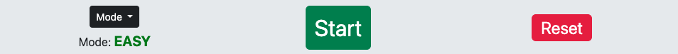
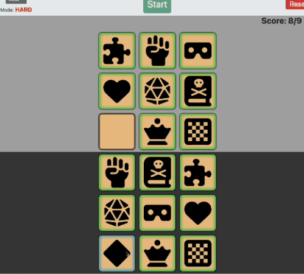

# Match-a-Tile

The 'Match-a-Tile' game is a memory challenge based on ['Kim's Game'](https://en.wikipedia.org/wiki/Kim%27s_Game) , whereby the player is shown a number of items, which are then covered after a period of time. The player then has to remember the items they were shown and guess what was there. In this version of the game, players must match the tiles at the bottom of the screen with the computer's tiles.

The primary goal of this project is to offer the user a fun and interactive game to play while, at the same time, provide a challenge to test the user's memory.

Visit the deployed site [here](https://danhodgson12.github.io/Match-a-Tile/).

---

# User Experience (UX)

## Project Goals

- The game can be easily navigated and understood.
- Clearly explains the concept of the game.
- Clearly explains how to play the game.
- Contains clear imagery and content.
- Provides interactivity in the form of clickable elements.
- Provides feedback in the form of elements changing state.
- Provides a score system and conveys it clearly.
- Provides feedback in the form of displaying how many turns the player has left.
- Offers the user the ability to challenge their memory skills.
- The game can be played on a variety of screen sizes.

## User Stories

- As a user, I want to be able to navigate the game easily, so that I can start playing the game as soon as possible.
- As a user, I want to know what the game is about, so that I can understand the concept behind it.
- As a user, I want to see the game's instructions, so that I can understand how to play it.
- As a user, I want to see the images clearly, so that I can confidently memorise them and match the tiles together.
- As a user, I want to be able to interact with the game, so that I can have a fun experience.
- As a user, I want to be given feedback when I interact with the game, so I know whether or not I have successfully matched the tiles together.
- As a user, I want to be able to see my score, so I know how well I've done.
- As a user, I want to know how many turns I have left, so I have an idea of when the game will be over.
- As a user, I want to challenge my memory skills, so that I can adopt an enjoyable process for engaging my mind.
- As a user, I want the web application to be responsive, so that I can play the game on a variety of screen sizes.

## Colour Scheme

The colours used for this website are:

- Sunset (#EAC086) - for the computer & player tiles and the navbar logo. This colour is loosely based on the colour for the [Scrabble](https://en.wikipedia.org/wiki/Scrabble) tile.
- Papaya Whip (#FFEFD5) - for the SideBar.
- Silver (#A9A9A9) - for the computer-tiles background
- Onyx (#3D3D3D) - for the player-tiles background.
- Eerie Black (#212529) - for the Mode-selection, About and Instructions buttons.

## Typography

The font used throughout this project is the sans-serif font that loads as standard depending on browser choice. The reason behind this was to keep the styling basic and focus more on the functionality of the game. Also, the standard font looks appropriate and it goes well with the styling of the images for the tiles.

## Wireframes

[Figma](https://www.figma.com/) was used to showcase the initial concept of the game across the three main screen sizes. The layout of the game remained largely the same as the project progressed, with some changes to the Sidebar and the location of the Mode button and Player Tiles.

The full version of wireframes can be viewed [here](https://www.figma.com/file/FKLPRejh6ElgwCStCXU0IF/Match-a-Tile-WireFrames?type=design&node-id=0-1&mode=design&t=1RPCNTWt2wE6rDEL-0).

Device | Wireframe
--- | ---
Desktop | 
Tablet | 
Phone | 

# Features

- The website was designed from a mobile-first perspective.
- The website is responsive on all screen sizes, including very small screens such as the Galaxy Fold.
  - This allows the user to [view the website on a variety of screen sizes](#user-stories).

## Navbar

The Navbar consists of:

- The game logo (styled from the tiles used in the game).
  - This is a clickable button that refreshes the page and resets the game.
- The game heading.
- The About button.
  - This opens a modal with information about the game.
  - This allows the user to [understand the concept behind the game](#user-stories).

- The Instructions button.
  - This opens a modal with the instructions for the game.
  - This allows the user to [understand how to play the game](#user-stories).

On larger screen sizes, the About and Instructions buttons disappear and this information is displayed in the [SideBar](#sidebar).

## SideBar

The SideBar consists of:

- The About button.
  - This slide-toggles a drop-down box showing information about the game.
  - This allows the user to [understand the concept behind the game](#user-stories).
- The Instructions button.
  - This slide-toggles a drop-down box showing the instructions for the game.
  - This allows the user to [understand how to play the game](#user-stories).

On screen sizes below large, the SideBar disappears and the About and Information buttons move to the [Navbar](#navbar).

## Controls

The Controls area consists of:

### Mode Selection

- This toggles a drop-down menu where the user can select a mode (Easy, Normal or Hard).
- This allows the user to try out different difficulties and [challenge their memory skills, so they can adopt an enjoyable process for engaging their mind](#user-stories).

### Mode Display

- This displays the mode the user has selected from the Mode selection drop-down menu.
- The mode displayed changes depending on the user's selection.

### Start Button

- This starts the game, which causes several things to happen:
  - Disables the Start button.
  - Disables the Mode selection button.
  - Assigns random images to the Computer Tiles.
  - Shuffles those same images and assigns them to the Player Tiles.
  - Starts the Countdown Timer.
  - Shows the Computer Tiles.
  - Hides the Computer Tiles once the Countdown Timer ends.
  - Shows the Player Tiles once the Countdown Timer ends.
- The Start button was made larger than the other controls and styled around the traffic light system, i.e. "Green = Go, Red = Stop".
  - This allows the user to [navigate the game easily, so that they can start playing the game as soon as possible](#user-stories).

### Reset Button

- This resets the game, which causes several things to happen:
  - Hides both the Computer and Player Tiles.
  - Removes all images from all Tiles.
  - Resets the 'Score' and 'Turns Left' displays.
  - Enables the Start button.
  - Enables the Mode selection button.

## Computer Area

The Computer Area consists of:

### Turns Left

- This displays the number of the turns the user has left to match the tiles, [indicating when the game will be over](#user-stories).
- The number of turns left at the start of the game is determined by the Mode selected:
  - Easy - 18 turns
  - Normal - 14 turns
  - Hard - 9 turns
- When the Turns Left reaches 0, the game ends.

### Countdown Timer

- The Countdown Timer starts after the user has clicked the Start button.
- It counts down from 5 to the word 'GO'.
- It displays how long the user has to memorise the Computer Tiles before they are flipped over/hidden.
- Once it reaches the word 'GO', the Computer Tiles are hidden and the Player Tiles are shown.
- The game then begins and the user is able to click on the Player Tiles to match them with the Computer Tiles.

### Score

- The Score area displays the amount of correct matches the user has made, [allowing the user to see how well they've done](#user-stories).
- Once the Score reaches 9/9, the game ends.
  - However, the game can end prematurely if the Turns Left reaches 0 before the Score reaches 9/9.
  - For example, the user could use all of their turns and only score 4/9 and the game will end.
- The Score is reset at the start of the game or when the game is reset.
- The Score cannot exceed 9/9.

### Computer Tiles

- The Computer Tiles consist of 9 buttons that the user can click, [allowing the user to interact with the game, so they can have a fun experience](#user-stories).
  - The buttons are disabled at the start of the game.
  - The buttons are enabled after the user has clicked on a Player Tile so that it can be matched with a Computer Tile.
  - Once the user has successfully matched two Tiles, that particular Computer Tile will have a green inner-border and will be disabled.
  - If the user unsuccessfully matches two Tiles, that particular Computer Tile will momentarily have a red inner-border, but can be selected in the user's next turn. That Computer Tile will remain disabled until the user has clicked on a Player Tile to match it with a Computer Tile.
  - [This gives the user feedback, allowing them to know whether or not they have successfully matched the tiles together](#user-stories).
- These tiles flip over (so they are shown) when the user clicks the Start button and the Countdown Timer has begun.
- The tiles then flip over again (so they are hidden) once the Countdown Timer has ended.
- If the user successfully matches a Player Tile with a Computer Tile, that particular Computer Tile will flip over (be shown).
- If the user unsuccessfully matches the two tiles, that particular Computer Tile will remain hidden.
- A random selection of 9 images are assigned to the Computer Tiles after the user clicks the Start button.
- The tiles have been styled so they take up around half of the screen when the user is playing the game.
  - This allows the user to [see the images clearly, so they can confidently memorise them and match the tiles together](#user-stories).

## Player Tiles

- The Player Tiles consist of 9 buttons that the user can click, [allowing the user to interact with the game, so they can have a fun experience](#user-stories).
  - The buttons are disabled at the start of the game.
  - The buttons are enabled after the Countdown Timer has ended and the Computer Tiles have been flipped (hidden).
  - When the user has clicked on a Player Tile, all other Player Tiles are disabled and the Computer Tiles are enabled.
  - Once the user has successfully matched a Player Tile with a Computer Tile, that particular Player Tile will have a green inner-border and will be disabled.
  - If the user unsuccessfully matches two Tiles, that particular Player Tile will momentarily have a red inner-border, but can be selected in the user's next turn.
  - [This gives the user feedback, allowing them to know whether or not they have successfully matched the tiles together](#user-stories).
- These tiles flip over (so they are shown) after the Countdown Timer has ended and the Computer Tiles have been flipped (hidden).
- The tiles remain visible throughout the game.
- The same 9 images assigned to the Computer Tiles are shuffled and assigned to the Player Tiles at the start of the game.
- The tiles have been styled so they take up around half of the screen when the user is playing the game.
  - This allows the user to [see the images clearly, so they can confidently memorise them and match the tiles together](#user-stories).

## Flip Functionality

- The Computer Tiles and Player Tiles are flipped depending on the state of the game, or whether a successful match has been made.
- They flip on the Y-axis at a rate of 0.6 seconds.
- The images are assigned to the tiles before any of the tiles are flipped.
  - This ensures that the user has enough time to register the image.
  - It also adds to the visual representation of the game.

## Tile Matching

- When the user clicks on a Player Tile, a blue inner-border is added to indicate it has been clicked.
  - If the user then clicks on a Computer Tile and it's a successful match:
    - The Computer Tile flips over (is shown) and a green inner-border is added.
    - A green inner-border is also added to the Player Tile.
    - Both tiles are disabled for the remainder of the game.
  - If the user then clicks on a Computer Tile and it's not a match:
    - The Computer Tile momentarily gains a red inner-border but does not flip over (remains hidden).
    - The Player Tile momentarily gains a red inner-border but can be selected in the user's next turn.

## Game Over

- When the user has scored 9 out of 9 and/or has run out of turns, the Game Over function is executed.
  - The phrase GAME OVER appears above the Computer Tiles.
  - An modal is displayed at the top of the screen.
    - The modal shows the user's Score and a unique message depending on their score.
  - The user can then click anywhere on the screen to close the modal and click the Reset button to reset the game.

## Footer

The Footer consists of:

- Copyright information.

No other links or information were included in the Footer as the developer thought it was unnecessary for the purpose of the project.

# Technologies Used

## Languages

- [HTML](https://en.wikipedia.org/wiki/HTML)
- [CSS](https://en.wikipedia.org/wiki/CSS)
- [JavaScript](https://en.wikipedia.org/wiki/JavaScript)

## Frameworks, Libraries & Programs

- [Font Awesome](https://fontawesome.com/)
  - Font Awesome was used to add icons/images to the computer and player tiles.

- [Codeanywhere](https://app.codeanywhere.com/)
  - Codeanywhere was used for writing, committing and pushing the code to GitHub.

- [Bootstrap 5](https://getbootstrap.com/)
  - Bootstrap 5 was used to develop a responsive mobile-first design using an assortment of templates.

- [jQuery](https://jquery.com/)
  - jQuery was used as the preferred JavaScript library for HTML document traversal and manipulation, event handling and animation.

- [Chrome DevTools](https://developer.chrome.com/docs/devtools/)
  - Chrome DevTools was used throughout the development of the website to test ideas and responsiveness, as well as test functionality of the game and debug issues that arose.

- [W3C Markup Validator](https://validator.w3.org/)
  - W3C Markup Validator was used to validate the HTML code.

- [W3C CSS Validator](https://jigsaw.w3.org/css-validator/)
  - W3C CSS Validator was used to validate the CSS code.

- [JSLint](https://www.jslint.com/)
  - JSLint was used to validate the JavaScript.

- [Favicon.io](https://favicon.io/)
  - Favicon.io was used to create the site favicon.

# Testing

A large amount of testing was undertaken throughout the project in order to assess if the game was working as expected.

Friends and family also participated in testing the game's functionality and expressed any concerns or ideas they had with function, layout and user experience.

Please see a detailed breakdown of the testing carried out for this project in [TESTING.md](TESTING.md).

# Finished Product

Device | Image
--- | ---
Desktop | 
Tablet | 
Phone | 

# Deployment

This website was developed using [Codeanywhere](https://codeanywhere.com/solutions/collaborate), then committed and pushed to GitHub using the Codeanywhere terminal.

## GitHub Pages

The project was deployed to GitHub Pages using the following steps:

1. Log into GitHub and locate the [GitHub Repository](https://github.com/DanHodgson12/Match-a-Tile).
2. At the top of the page, locate the "Settings" button on the menu bar.
   
3. Under "Code and automation" on the left-hand side of the window, click the "Pages" tab.
   
4. Under "Source", select the option "Deploy from a branch".
5. Under "Branch", select the option "main", then select the "/(root)" folder.
6. Click "Save" and the page will refresh.
7. The published site link appears at the top of the "GitHub Pages" section.
8. Click "Visit Site" and the website will open.

## Making a Local Clone

To make a clone of this project, please use the following steps:

1. Log into GitHub and locate the [GitHub Repository](https://github.com/DanHodgson12/Match-a-Tile).
2. At the top of the Repository (not top of page), locate and click on the "< > Code" button on the menu bar.
3. In the "Local" tab, beneath where it says "Clone", select the "HTTPS" option.
4. Just below that, copy the link for the repository.
5. Open Git Bash.
6. Change the current working directory to the location where you want the cloned directory to be made.
7. Type `git clone`, and then paste the URL you copied in Step 3.
8. Press Enter. Your local clone will be created.

# Credits

## Content

- All content was written by the developer.

## Media

- [Font Awesome](https://fontawesome.com/icons/categories/gaming) was used for providing the images to assign to the game tiles.
- All other styling and media was created by the developer.

## Code

- [Bootstrap 5](https://getbootstrap.com/docs/5.3/getting-started/introduction/) was used throughout to help with responsiveness and styling purposes.
- [MDN_](https://developer.mozilla.org/en-US/docs/Web/API/Element/scrollIntoView) was used to help add the scrollIntoView() function.
- [saturncloud.io](https://saturncloud.io/blog/how-to-randomize-shuffle-a-javascript-array/#:~:text=The%20Fisher%2DYates%20(Knuth)%20Shuffle%20Algorithm&text=The%20shuffle%20function%20takes%20an,random()%20function) was used for help utilising the shuffleArray() function.
- [W3Schools](https://www.w3schools.com/) was used for inspiration for:
  - The [Flip](https://www.w3schools.com/howto/howto_css_flip_card.asp) effect for the tiles.
  - The [KeyFrames](https://www.w3schools.com/cssref/css3_pr_animation-keyframes.php) animation for the countdown timer.
- [W3Schools](https://www.w3schools.com/) & [Stack Overflow](https://stackoverflow.co/teams/) were consulted on a regular basis to help overcome roadblocks in the developer's coding knowledge.

# Acknowledgements

- My family, for their valuable opinions and unconditional support.
- My mentor, Marcel, for his encouraging feedback and patience during my learning journey.
- Code Institute, for its wonderful learning platform and supportive community.
