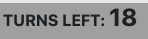

# Match-a-Tile

The 'Match-a-Tile' game is a memory challenge based on 'Kim's Game' , whereby the player is shown a number of items, which are then covered after a period of time. The player then has to remember the items they were shown and guess what was there. In this version of the game, players must match the tiles at the bottom of the screen with the computer's tiles.

The primary goal of this project is to offer the user a fun and interactive game to play while, at the same time, provide a challenge to test the user's memory.

Visit the deployed site [here](https://danhodgson12.github.io/Match-a-Tile/).

---

# User Experience (UX)

## Project Goals

- The game can be easily navigated and understood.
- Clearly explains the concept of the game.
- Clearly explains how to play the game.
- Contains clear imagery and content.
- Provides interactivity in the form of clickable elements.
- Provides feedback in the form of elements changing state.
- Provides a score system and conveys it clearly.
- Provides feedback in the form of displaying how many turns the player has left.
- Offers the user the ability to challenge their memory skills.
- The game can be played on a variety of screen sizes.

## User Stories

- As a user, I want to be able to navigate the game easily, so that I can start playing the game as soon as possible.
- As a user, I want to know what the game is about, so that I can understand the concept behind it.
- As a user, I want to see the game's instructions, so that I can understand how to play it.
- As a user, I want to see the images clearly, so that I can confidently memorise them and match the tiles together.
- As a user, I want to be able to interact with the game, so that I can have a fun experience.
- As a user, I want to be given feedback when I interact with the game, so I know whether or not I have successfully matched the tiles together or not.
- As a user, I want to be able to see my score, so I know how well I've done.
- As a user, I want to know how many turns I have left, so I have an idea of when the game will be over.
- As a user, I want to challenge my memory skills, so that I can adopt an enjoyable process for engaging my mind.
- As a user, I want the web application to be responsive, so that I can play the game on a variety of screen sizes.

## Colour Scheme

The colours used for this website are:

- Sunset (#EAC086) - for the computer & player tiles and the navbar logo. This colour is loosely based on the color for the [Scrabble](https://en.wikipedia.org/wiki/Scrabble) tile.
- Papaya Whip (#FFEFD5) - for the side bar.
- Silver (#A9A9A9) - for the computer-tiles background
- Onyx (#3D3D3D) - for the player-tiles background.
- Eerie Black (#212529) - for the Mode-selection, About and Instructions buttons.

## Typography

The font used throughout this project is the sans-serif font that loads as standard depending on browser choice. The reason for this is that I wanted to keep the styling basic and focus more on the functionality of the game. Also, I like how the standard font looks and feel it goes well with the styling of the images for the tiles.

## Wireframes

[Figma](https://www.figma.com/) was used to showcase the visuals of the game across the three main screen sizes.

The full version of wireframes can be viewed [here](https://www.figma.com/file/FKLPRejh6ElgwCStCXU0IF/Match-a-Tile-WireFrames?type=design&node-id=0-1&mode=design&t=1RPCNTWt2wE6rDEL-0).

Device | Wireframe
--- | ---
Desktop | 
Tablet | 
Phone | 

# Features

- The website was designed from a mobile-first perspective.
- The website is responsive on all screen sizes, including very small screens such as the Galaxy Fold.
  - This allows the user to [view the website on a variety of screen sizes](#user-stories).

## Navbar

The Navbar consists of:

- The game logo (styled from the tiles used in the game).
  - This is a clickable button that refreshes the page and resets the game.
- The game heading.
- The About button.
  - This opens a modal with information about the game.

- The Instructions button.
  - This opens a modal with the instructions for the game.

On larger screen sizes, the About and Instructions buttons disappear and this information is displayed in the [Side Bar](#side-bar).

## Side Bar

The Side Bar consists of:

- The About button.
  - This slide-toggles a drop-down box showing information about the game.
- The Information button.
  - This slide-toggles a drop-down box showing the instructions for the game.

On screen sizes below large, the Side Bar disappears and the About and Information buttons move to the [Navbar](#navbar).

## Controls

The Controls area consists of:

### Mode Selection

- This toggles a drop-down menu where the user can select a mode (Easy, Normal or Hard).

### Mode Display

- This displays the mode the user has selected from the Mode selection drop-down menu.
- The mode displayed changes depending on the user's selection.

### Start Button

- This starts the game, which causes several things to happen:
  - Disables the Start button.
  - Disables the Mode selection button.
  - Assigns random images to the Computer Tiles.
  - Shuffles those same images and assigns them to the Player Tiles.
  - Starts the Countdown Timer.
  - Shows the Computer Tiles.
  - Hides the Computer Tiles once the Countdown Timer ends.
  - Shows the Player Tiles once the Countdown Timer ends.

### Reset Button

- This resets the game, which causes several things to happen:
  - Hides both the Computer and Player Tiles.
  - Removes all images from all Tiles.
  - Resets the 'Score' and 'Turns Left' displays.
  - Enables the Start button.
  - Enables the Mode selection button.

## Computer Area

The Computer Area consists of:

### Turns Left

- This displays the number of the turns the user has left to match the tiles before the game is over.
- The number of turns left at the start of the game is determined by the Mode selected:
  - Easy - 18 turns
  - Normal - 14 turns
  - Hard - 9 turns
- When the Turns Left reaches 0, the game ends.

### Countdown Timer

- The Countdown Timer starts after the user has clicked the Start button.
- It counts down from 5 to the word 'GO'.
- It displays how long the user has to memorise the Computer Tiles before they are flipped over/hidden.
- Once it reaches the word 'GO', the Computer Tiles are hidden and the Player Tiles are shown.
- The game then begins and the user is able to click on the Player Tiles to match them with the Computer Tiles.

### Score

- The Score area displays the amount of correct matches the user has made.
- Once the Score reaches 9/9, the game ends.
  - However, the game can end prematurely if the Turns Left reaches 0 before the Score reaches 9/9.
  - For example, the user could use all of their turns and only score 4/9 and the game will end.
- The Score is reset at the start of the game or when the game is reset.
- The Score cannot exceed 9/9.

### Computer Tiles

- The Computer Tiles consist of 9 buttons that the user can click.
  - The buttons are disabled at the start of the game.
  - The buttons are enabled after the user has clicked on a Player Tile so that it can be matched with a Computer Tile.
  - Once the user has successfully matched two Tiles, that particular Computer Tile will have a green inner-border and will be disabled.
  - If the user unsuccessfully matches two Tiles, that particular Computer Tile will momentarily have a red inner-border, but can be selected in the user's next turn. That Computer Tile will remain disabled until the user has clicked on a Player Tile to match it with a Computer Tile.
- These tiles flip over (so they are shown) when the user clicks the Start button and the Countdown Timer has begun.
- The tiles then flip over again (so they are hidden) once the Countdown Timer has ended.
- If the user successfully matches a Player Tile with a Computer Tile, that particular Computer Tile will flip over (be shown).
- If the user unsuccessfully matches the two tiles, that particular Computer Tile will remain hidden.
- A random selection of 9 images are assigned to the Computer Tiles after the user clicks the Start button.

## Player Tiles

- The Player Tiles consist of 9 buttons that the user can click.
  - The buttons are disabled at the start of the game.
  - The buttons are enabled after the Countdown Timer has ended and the Computer Tiles have been flipped (hidden).
  - When the user has clicked on a Player Tile, all other Player Tiles are disabled and the Computer Tiles are enabled.
  - Once the user has successfully matched a Player Tile with a Computer Tile, that particular Player Tile will have a green inner-border and will be disabled.
  - If the user unsuccessfully matches two Tiles, that particular Player Tile will momentarily have a red inner-border, but can be selected in the user's next turn.
- These tiles flip over (so they are shown) after the Countdown Timer has ended and the Computer Tiles have been flipped (hidden).
- The tiles remain visible throughout the game.
- The same 9 images assigned to the Computer Tiles are shuffled and assigned to the Player Tiles at the start of the game.

## Flip Functionality

- The Computer Tiles and Player Tiles are flipped depending on the state of the game, or whether a successful match has been made.
- They flip on the Y-axis at a rate of 0.6 seconds.
- The images are assigned to the tiles before any of the tiles are flipped.
  - This ensures that the user has enough time to register the image.
  - It also adds to the visual representation of the game.

## Tile Matching

- When the user clicks on a Player Tile, a blue inner-border is added to indicate it has been clicked.
  - If the user then clicks on a Computer Tile and it's a successful match:
    - The Computer Tile flips over (is shown) and a green inner-border is added.
    - A green inner-border is also added to the Player Tile.
    - Both tiles are disabled for the remainder of the game.
  - If the user then clicks on a Computer Tile and it's not a match:
    - The Computer Tile momentarily gains a red inner-border but does not flip over (remains hidden).
    - The Player Tile momentarily gains a red inner-border but can be selected in the user's next turn.

## Game Over

- When the user has scored 9 out of 9 and/or has run out of turns, the Game Over function is executed.
  - The phrase GAME OVER appears above the Computer Tiles.
  - An 'Alert' is displayed at the top of the screen.
    - The 'Alert' displays the user's Score.
- The user then has to click the 'Alert' and click the Reset button to reset the game.

## Footer

The Footer consists of:

- Copyright information.

No other links or information were included in the Footer as the developer thought it was unnecessary for the purpose of the project.

# Technologies Used

## Languages

- [HTML](https://en.wikipedia.org/wiki/HTML)
- [CSS](https://en.wikipedia.org/wiki/CSS)
- [JavaScript](https://en.wikipedia.org/wiki/JavaScript)

## Frameworks, Libraries & Programs

- [Font Awesome](https://fontawesome.com/)
  - Font Awesome was used to add icons/images to the computer and player tiles.

- [Codeanywhere](https://app.codeanywhere.com/)
  - Codeanywhere was used for writing, committing and pushing the code to GitHub.

- [Bootstrap 5](https://getbootstrap.com/)
  - Bootstrap 5 was used to develop a responsive mobile-first design using an assortment of templates.

- [jQuery](https://jquery.com/)
  - jQuery was used as the preferred JavaScript library for HTML document traversal and manipulation, event handling and animation.

- [Chrome DevTools](https://developer.chrome.com/docs/devtools/)
  - Chrome DevTools was used throughout the development of the website to test ideas and responsiveness, as well as test functionality of the game and debug issues that arose.

- [W3C Markup Validator](https://validator.w3.org/)
  - W3C Markup Validator was used to validate the HTML code.

- [W3C CSS Validator](https://jigsaw.w3.org/css-validator/)
  - W3C CSS Validator was used to validate the CSS code.

- [JSLint](https://www.jslint.com/)
  - JSLint was used to validate the JavaScript.

- [Favicon.io](https://favicon.io/)
  - Favicon.io was used to create the site favicon.

# Testing

- A large amount of testing was undertaken throughout the project in order to assess the game was working as expected.
- Friends and family participated in testing the game's functionality and express any concerns or ideas they have with function, layout and user experience.

## Testing Paradigms

There are two types of testing a developer can carry out before, during and after writing a web application - Automated and Manual.

### Automated Testing

1. __Quicker__: Automated testing allows for hundreds of tests to be run in a short space of time, making it more resourceful than Manual testing.
2. __Efficient__: Tests written by developers help to detect errors earlier on, and help avoid writing code that likely won't perform as expected.
3. __Specific__: Tests can be written for specific edge cases in which manual testing may not be able to pick up.
4. __Resourceful__: Automated tests can be used for continuous testing of an application, making it easier to find an error if a new piece of content is added to a page, for example.
5. __Data-driven__: Automated testing can be used to check if a piece of code provides the same outcome when using different sources of data.

### Manual Testing

1. __UX(User Experience)__: Manual testing allows for the developer to check if the user experience of the application is as intended.
2. __Layout/Responsiveness__: Manual testing allows for the developer to inspect the application on different browsers and devices, which is something automated testing would not pick up on.
3. __Animation & Interactivity__: Manual testing allows for the developer to check if animations and interactions between elements are performing as expected.
4. __Accessibility__: Manual testing allows the developer to test the application with screen readers and make sure it is accessible.

Although one form of testing may be more appropriate than the other for a specific application, they do both have downsides. The disadvantage of one form of testing is usually something the other form of testing can provide.

Due to this, it is best practice to utilise both forms of testing during the building of an application. However, the choice for which form of testing to use depends on resources available, budget and whether or not you have a team large enough to carry out the tests.

## Testing User Stories

- __As__ a user, I want to be able to navigate the game easily, __So__ that I can start playing the game as soon as possible.
  - __Given__ I load the game, __When__ I look at the Navbar, __Then__ I should be able to see that the game consists of only one page, And I don't need to navigate to other pages.

- __As__ a user, I want to know what the game is about, __So__ that I can understand the concept behind it.
  - __Given__ I navigation to the Navbar or Side Bar, __When__ I click the 'About' button, __Then__ I should be able to see information explaining the concept of the game.

- __As__ a user, I want to see the game's instructions, __So__ that I can understand how to play it.
  - __Given__ I navigation to the Navbar or Side Bar, __When__ I click the 'Instructions' button, __Then__ I should be able to see information explaining how to play the game.

- __As__ a user, I want to see the images clearly, __So__ that I can confidently memorise them and match the tiles together.
  - __Given__ I click the Start button, __When__ the tiles flip over, __Then__ I should be able to see clear images, And have the correct amount of time to memorise them.

- __As__ a user, I want to be able to interact with the game, __So__ that I can have a fun experience.
  - __Given__ I click the Start button, __When__ the countdown timer has finished, __Then__ I should be able to click on the Player Tiles and match them with the Computer Tiles.

- __As__ a user, I want to be given feedback when I interact with the game, __So__ I know whether or not I have successfully matched the tiles together or not.
  - __Given__ I attempt to match two tiles together, __When__ I get it right, __Then__ I should be able to see a clear green border on both tiles to indicate a correct match.
  - __Given__ I attempt to match two tiles together, __When__ I get it wrong, __Then__ I should be able to see a clear red border on both tiles to indicate an incorrect match.

- __As__ a user, I want to be able to see my score, __So__ I know how well I've done.
  - __Given__ I match two tiles together correctly, __When__ I look at the Score area, __Then__ I can see the score increment by 1 each time.

- __As__ a user, I want to know how many turns I have left, __So__ I have an idea of when the game will be over.
  - __Given__ I attempt to match two tiles together, __When__ I look at the Turns Left area, __Then__ I can see the Turns Left reduce by 1 each time.

- __As__ a user, I want to challenge my memory skills, __So__ that I can adopt an enjoyable process for engaging my mind.
  - __Given__ I click the Mode button, __When__ I select a harder difficulty, __Then__ I can see that I have less turns to attempt to match the tiles together.

- __As__ a user, I want the web application to be responsive, __So__ that I can play the game on a variety of screen sizes.
  - __Given__ I load the web application, __When__ I load it on different screen sizes, __Then__ I will see the layout change to suit the screen size accordingly.

## Code Validation

The [W3C Markup Validator](https://validator.w3.org/) and [W3C CSS Validator](https://jigsaw.w3.org/css-validator/) services were used to check for any code errors or misuse of syntax/elements in the HTML & CSS.

The W3C Markup Validator returned a one error:

- The use of `div` elements inside `button` elements.
  - This was overcome by changing the `div` elements to `span` elements.

The W3C CSS Validator returned no errors in the code.

The [JS Hint](https://jshint.com/) service was used to check for any code errors or misuse of syntax in the JavaScript.

JS Hint returned no errors or warnings. However, it did report several instances of undefined variables.

This was due to the use of jQuery throughout the project and didn't require adjustments to the code.

## Lighthouse Report

Lighthouse in Google Chrome Dev Tools was used to test performance, accessibility, best practices and search engine optimisation of the webpage.

One of the suggestions made for increasing Performance was to remove element IDs that weren't defined in CSS. However, elements that fell into this category had IDs for manipulation via JavaScript.

## Tools Testing

- [Google Chrome DevTools](https://developer.chrome.com/docs/devtools/)
  - Google Chrome DevTools was used throughout the development process to test, explore and make changes to the HTML and CSS of the webpage.
  - Google Chrome DevTools was used throughout the development process to test, explore and make changes to the JavaScript controlling the game's functionality, including the use of 'console.log'.

- Responsiveness
  - [Responsive Design Checker](https://www.responsivedesignchecker.com/) was used to check responsiveness across a variety of devices and screen sizes.
  - [Am I Responsive?](https://ui.dev/amiresponsive) was used to check responsiveness across different screen sizes and generate the mockup final image.
  - [Google Chrome DevTools](https://developer.chrome.com/docs/devtools/) was used to check responsiveness across different screen sizes during the development and testing phases.

## Compatibility Testing

### Browser Compatibility

Browser | Outcome | Pass/Fail
--- | --- | ---
Google Chrome | No appearance, responsiveness or functionality issues | Pass
Safari | No appearance, responsiveness or functionality issues | Pass
Mozilla Firefox | No appearance, responsiveness or functionality issues | Pass
Microsoft Edge | No appearance, responsiveness or functionality issues | Pass
  
### Device Compatibility

The web application was tested across a wide variety of devices using [Google Chrome DevTools](https://developer.chrome.com/docs/devtools/) & [Responsive Design Checker](https://www.responsivedesignchecker.com/) - no appearance, responsiveness or functionality issues were found, other than:

- The full game area is too tall to be seen on the screen for phones with screen sizes similar to that of an Iphone 4, so the user would need to scroll up and down manually.
  - The developer chose to ignore this issue as adjusting the layout would compromise on the maximum size of the images displayed on the tiles.

## Common Elements Testing

### Navbar

#### Navbar Logo

Outcome | Pass/Fail
--- | ---
Reloads the page and resets the game as expected | Pass

#### About Button

Outcome | Pass/Fail
--- | ---
Is only displayed on screen widths less than 992px as expected | Pass
Opens the About Modal as expected | Pass

#### About Modal

Outcome | Pass/Fail
--- | ---
Displays the About information as expected | Pass
Closes when the user clicks anywhere on the screen as expected | Pass
Closes automaticaly when the screen size is manually adjusted | Pass
The link within the text opens in a new window as expected | Pass

#### Instructions Button

Outcome | Pass/Fail
--- | ---
Is only displayed on screen widths less than 992px as expected | Pass
Opens the Instructions Modal as expected | Pass

#### Instructions Modal

Outcome | Pass/Fail
--- | ---
Displays the Instructions information as expected | Pass
Closes when the user clicks anywhere on the screen as expected | Pass
Closes automaticaly when the screen size is manually adjusted | Pass
---

### Side Bar

#### Side Bar

Outcome | Pass/Fail
--- | ---
Is only displayed on screen widths larger than 991px as expected | Pass
Is shown/hidden when the window is manually resized as expected | Pass

#### About Section

Outcome | Pass/Fail
--- | ---
Is automatically displayed when the page is loaded as expected | Pass
Text adjusts to size of the section when window is manually resized as expected | Pass
The link within the text opens in a new window as expected | Pass
The button smoothly slide-toggles the About information to hidden/shown as expected | Pass

#### Instructions Section

Outcome | Pass/Fail
--- | ---
Is automatically displayed when the page is loaded as expected | Pass
Text adjusts to size of the section when window is manually resized as expected | Pass
The button smoothly slide-toggles the Instructions information to hidden/shown as expected | Pass
---

### Controls Area

#### Mode Button

Outcome | Pass/Fail
--- | ---
Toggles a dropdown menu with the modes "Easy", "Normal" and "Hard" as expected | Pass
Dropdown menu items can be selected by clicking them as expected | Pass

#### Mode Display

Outcome | Pass/Fail
--- | ---
The mode displayed changes depending on the dropdown menu item selected as expected | Pass
The mode displayed adjusts the number of Turns Left as expected | Pass

#### Start Button

Outcome | Pass/Fail
--- | ---
Starts the countdown timer and shows the Computer Tiles as expected | Pass
Disables the Start button and the Mode button as expected | Pass

#### Reset Button

Outcome | Pass/Fail
--- | ---
Hides the Player & Computer Tiles as expected | Pass
Resets the Turns Left and Score as expected | Pass
Enables the Start button and Mode button as expected | Pass
---

### Turns/Timer/Score Area

#### Turns Left

Outcome | Pass/Fail
--- | ---
Displays the turns the player has left as expected | Pass
Adjusts the number of turns left depending on Mode selected as expected | Pass
Number of turns left reduces by 1 each time the player attempts to match two tiles together as expected | Pass
Resets back to the relevant number of turns left when the Reset button is clicked as expected | Pass
The game ends when Turns Left reaches '0' (and/or the Score reaches '9/9') as expected | Pass
Turns Left cannot be reduced below '0' as expected | Pass

#### Countdown Timer

Outcome | Pass/Fail
--- | ---
Timer starts when the Start button is clicked as expected | Pass
Timer counts down from 5 to the word 'GO' as expected | Pass
The relevant tiles are shown/hidden when the timer reaches the word 'GO' as expected | Pass
Fades out 2 seconds after the timer reaches the word 'GO' as expected | Pass

#### Score

Outcome | Pass/Fail
--- | ---
Displays the players current score as expected | Pass
Is set to 0/9 when the page loads or when the Reset button is clicked as expected | Pass
Increments by 1 each time the player gets a correct match as expected | Pass
The game ends when the Score reaches '9/9' (and/or the Turns Left reaches '0') as expected | Pass
Score cannot be incremented above '9/9' as expected | Pass
---

### Computer Tiles

#### Image Assignment/Display

Outcome | Pass/Fail
--- | ---
Images are shuffled and randomly assigned to tiles as expected | Pass
Images are centered within the tile, oriented correctly, and clearly visible as expected | Pass

#### Flip Functionality

Outcome | Pass/Fail
--- | ---
Tiles are flipped at the correct rate on the Y-axis as expected | Pass
Images are assigned to the front of the tiles before the Flip Function is executed as expected | Pass
The backs of the tiles are visible and the front of the tiles are hidden by default as expected | Pass
Tiles are unflipped (shown) when the Start button has been clicked and flipped (hidden) when the countdown timer has ended as expected | Pass
Tile is unflipped (shown) when a correct match has been made with a Player Tile and Computer Tile as expected | Pass

#### Click Functionality

Outcome | Pass/Fail
--- | ---
Tile 'buttons' are disabled by default when the page loads and the game is started as expected | Pass
Tile 'buttons' are enabled after a Player Tile has been selected as expected | Pass
Individual Computer Tiles are disabled indefinitely if a correct match has been made as expected | Pass
Individual Computer Tiles gain a green border if a correct match has been made as expected | Pass
Individual Computer Tiles momentarily gain a red border if an incorrect match has been made as expected | Pass
Tiles are disabled when the game is over as expected | Pass
---

### Player Tiles

#### Image Assignment/Display

Outcome | Pass/Fail
--- | ---
The same images assigned to the Computer Tiles are shuffled again and randomly assigned to Player Tiles as expected | Pass
Images are centered within the tile, oriented correctly, and clearly visible as expected | Pass

#### Flip Functionality

Outcome | Pass/Fail
--- | ---
Tiles are flipped at the correct rate on the Y-axis as expected | Pass
Images are assigned to the front of the tiles before the Flip Function is executed as expected | Pass
The backs of the tiles are visible and the front of the tiles are hidden by default as expected | Pass
Tiles are unflipped (shown) when the countdown timer has ended as expected | Pass
Tiles remain unflipped (shown) for the remainder of the game (until page is reloaded or game is reset) as expected | Pass

#### Click Functionality

Outcome | Pass/Fail
--- | ---
Tile 'buttons' are disabled by default when the page loads and the game is started as expected | Pass
Tile 'buttons' are enabled when the countdown timer has ended as expected | Pass
Individual Player Tiles are disabled indefinitely if a correct match has been made as expected | Pass
Player Tiles are disabled after an individual Player Tile has been clicked as expected | Pass
Player Tiles are enabled after player has clicked a Computer Tile and attempted to match it with the Player Tile selected as expected | Pass
Individual Player Tiles gain a blue border when clicked as expected | Pass
Blue border disappears after player clicks on a Computer Tile to attempt a match as expected | Pass
Individual Player Tiles gain a green border if a correct match has been made as expected | Pass
Individual Player Tiles momentarily gain a red border if an incorrect match has been made as expected | Pass
Tiles are disabled when the game is over as expected | Pass
---

### Known Bugs

There are no known bugs with the web application.

# Finished Product

Device | Image
--- | ---
Desktop | 
Tablet | 
Phone | 

# Deployment

This website was developed using [Codeanywhere](https://codeanywhere.com/solutions/collaborate), then committed and pushed to GitHub using the Codeanywhere terminal.

## GitHub Pages

The project was deployed to GitHub Pages using the following steps:

1. Log into GitHub and locate the [GitHub Repository](https://github.com/DanHodgson12/Match-a-Tile).
2. At the top of the page, locate the "Settings" button on the menu bar.
   
3. Under "Code and automation" on the left-hand side of the window, click the "Pages" tab.
   
4. Under "Source", select the option "Deploy from a branch".
5. Under "Branch", select the option "main", then select the "/(root)" folder.
6. Click "Save" and the page will refresh.
7. The published site link appears at the top of the "GitHub Pages" section.
8. Click "Visit Site" and the website will open.

## Making a Local Clone

To make a clone of this project, please use the following steps:

1. Log into GitHub and locate the [GitHub Repository](https://github.com/DanHodgson12/Match-a-Tile).
2. At the top of the Repository (not top of page), locate and click on the "< > Code" button on the menu bar.
3. In the "Local" tab, beneath where it says "Clone", select the "HTTPS" option.
4. Just below that, copy the link for the repository.
5. Open Git Bash.
6. Change the current working directory to the location where you want the cloned directory to be made.
7. Type `git clone`, and then paste the URL you copied in Step 3.
8. Press Enter. Your local clone will be created.

# Credits

## Content

- All content was written by the developer.

## Media

- [Font Awesome](https://fontawesome.com/icons/categories/gaming) was used for providing the images to assign to the game tiles.
- All other styling and media was created by the developer.

## Code

- [Bootstrap 5](https://getbootstrap.com/docs/5.3/getting-started/introduction/) was used throughout to help with responsiveness and styling purposes.
- [MDN_](https://developer.mozilla.org/en-US/docs/Web/API/Element/scrollIntoView) was used for help adding the scrollIntoView() function.
- [saturncloud.io](https://saturncloud.io/blog/how-to-randomize-shuffle-a-javascript-array/#:~:text=The%20Fisher%2DYates%20(Knuth)%20Shuffle%20Algorithm&text=The%20shuffle%20function%20takes%20an,random()%20function) was used for help utilising the shuffleArray() function.
- [W3Schools](https://www.w3schools.com/) was used for inspiration for:
  - The [Flip](https://www.w3schools.com/howto/howto_css_flip_card.asp) effect for the tiles.
  - The [KeyFrames](https://www.w3schools.com/cssref/css3_pr_animation-keyframes.php) animation for the countdown timer.
- [W3Schools](https://www.w3schools.com/) & [Stack Overflow](https://stackoverflow.co/teams/) were consulted on a regular basis to help overcome roadblocks in the developer's coding knowledge.

# Acknowledgements

- My family, for their valuable opinions and unconditional support.
- My mentor, Marcel, for his encouraging feedback and patience during my learning journey.
- Code Institute, for its wonderful learning platform and supportive community.
