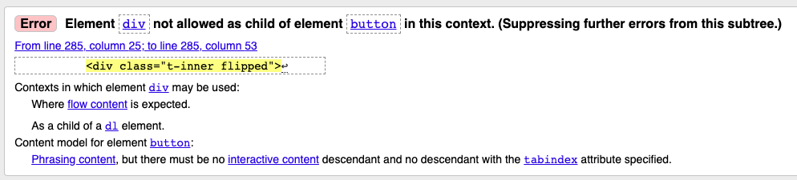
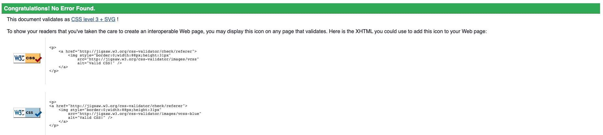
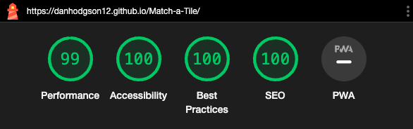

# Testing

## Testing Paradigms

There are two types of testing a developer can carry out before, during and after writing a web application - Automated and Manual.

### Automated Testing

1. __Quicker__: Automated testing allows for hundreds of tests to be run in a short space of time, making it more resourceful than Manual testing.
2. __Efficient__: Tests written by developers help to detect errors earlier on, and help avoid writing code that likely won't perform as expected.
3. __Specific__: Tests can be written for specific edge cases in which manual testing may not be able to pick up.
4. __Resourceful__: Automated tests can be used for continuous testing of an application, making it easier to find an error if a new piece of content is added to a page, for example.
5. __Data-driven__: Automated testing can be used to check if a piece of code provides the same outcome when using different sources of data.

### Manual Testing

1. __UX(User Experience)__: Manual testing allows for the developer to check if the user experience of the application is as intended.
2. __Layout/Responsiveness__: Manual testing allows for the developer to inspect the application on different browsers and devices, which is something automated testing would not pick up on.
3. __Animation & Interactivity__: Manual testing allows for the developer to check if animations and interactions between elements are performing as expected.
4. __Accessibility__: Manual testing allows the developer to test the application with screen readers and make sure it is accessible.

Although one form of testing may be more appropriate than the other for a specific application, they do both have downsides. The disadvantage of one form of testing is usually something the other form of testing can provide.

Due to this, it is best practice to utilise both forms of testing during the building of an application. However, the choice for which form of testing to use depends on resources available, budget and whether or not you have a team large enough to carry out the tests.

The developer chose to use manual testing as the main form of testing throughout this project. They felt it was an efficient method for this type of application due to its size and the fact that a lot of the functions relied on visual aspects such as animations and styling changes.

## Testing User Stories

- __As__ a user, I want to be able to navigate the game easily, __So__ that I can start playing the game as soon as possible.
  - __Given__ I load the game, __When__ I look at the Navbar, __Then__ I should be able to see that the game consists of only one page, And I don't need to navigate to other pages.

- __As__ a user, I want to know what the game is about, __So__ that I can understand the concept behind it.
  - __Given__ I navigate to the Navbar or SideBar, __When__ I click the 'About' button, __Then__ I should be able to see information explaining the concept of the game.

- __As__ a user, I want to see the game's instructions, __So__ that I can understand how to play it.
  - __Given__ I navigate to the Navbar or SideBar, __When__ I click the 'Instructions' button, __Then__ I should be able to see information explaining how to play the game.

- __As__ a user, I want to see the images clearly, __So__ that I can confidently memorise them and match the tiles together.
  - __Given__ I click the Start button, __When__ the tiles flip over, __Then__ I should be able to see clear images, And have the correct amount of time to memorise them.

- __As__ a user, I want to be able to interact with the game, __So__ that I can have a fun experience.
  - __Given__ I click the Start button, __When__ the countdown timer has finished, __Then__ I should be able to click on the Player Tiles and match them with the Computer Tiles.

- __As__ a user, I want to be given feedback when I interact with the game, __So__ I know whether or not I have successfully matched the tiles together.
  - __Given__ I attempt to match two tiles together, __When__ I get it right, __Then__ I should be able to see a clear green border on both tiles to indicate a correct match.
  - __Given__ I attempt to match two tiles together, __When__ I get it wrong, __Then__ I should be able to see a clear red border on both tiles to indicate an incorrect match.

- __As__ a user, I want to be able to see my score, __So__ I know how well I've done.
  - __Given__ I match two tiles together correctly, __When__ I look at the Score area, __Then__ I can see the score increment by 1 each time.

- __As__ a user, I want to know how many turns I have left, __So__ I have an idea of when the game will be over.
  - __Given__ I attempt to match two tiles together, __When__ I look at the Turns Left area, __Then__ I can see the Turns Left reduce by 1 each time.

- __As__ a user, I want to challenge my memory skills, __So__ that I can adopt an enjoyable process for engaging my mind.
  - __Given__ I click the Mode button, __When__ I select a harder difficulty, __Then__ I can see that I have less turns to attempt to match the tiles together.

- __As__ a user, I want the web application to be responsive, __So__ that I can play the game on a variety of screen sizes.
  - __Given__ I load the web application, __When__ I load it on different screen sizes, __Then__ I will see the layout change to suit the screen size accordingly.

## Tools Testing

- [Google Chrome DevTools](https://developer.chrome.com/docs/devtools/)
  - Google Chrome DevTools was used throughout the development process to test, explore and make changes to the HTML and CSS of the webpage.
  - Google Chrome DevTools was used throughout the development process to test, explore and make changes to the JavaScript controlling the game's functionality, including the use of 'console.log'.

- Responsiveness
  - [Responsive Design Checker](https://www.responsivedesignchecker.com/) was used to check responsiveness across a variety of devices and screen sizes.
  - [Am I Responsive?](https://ui.dev/amiresponsive) was used to check responsiveness across different screen sizes and generate the mockup final image.
  - [Google Chrome DevTools](https://developer.chrome.com/docs/devtools/) was used to check responsiveness across different screen sizes during the development and testing phases.

## Compatibility Testing

### Browser Compatibility

Browser | Outcome | Pass/Fail
--- | --- | ---
Google Chrome | No appearance, responsiveness or functionality issues | Pass
Safari | No appearance, responsiveness or functionality issues | Pass
Mozilla Firefox | No appearance, responsiveness or functionality issues | Pass
Microsoft Edge | No appearance, responsiveness or functionality issues | Pass
  
### Device Compatibility

The web application was tested across a wide variety of devices using [Google Chrome DevTools](https://developer.chrome.com/docs/devtools/) & [Responsive Design Checker](https://www.responsivedesignchecker.com/) - no appearance, responsiveness or functionality issues were found, other than:

- The full game area is too tall to be seen on the screen for phones with screen sizes similar to that of an Iphone 4, so the user would need to scroll up and down manually.
  - The developer chose to ignore this issue as adjusting the layout would compromise on the maximum size of the images displayed on the tiles.

## Common Elements Testing

### Navbar

#### Navbar Logo

Outcome | Pass/Fail
--- | ---
Reloads the page and resets the game as expected | Pass

#### About Button

Outcome | Pass/Fail
--- | ---
Is only displayed on screen widths less than 992px as expected | Pass
Opens the About Modal as expected | Pass

#### About Modal

Outcome | Pass/Fail
--- | ---
Displays the About information as expected | Pass
Closes when the user clicks anywhere on the screen as expected | Pass
Closes automatically when the screen size is manually adjusted | Pass
The link within the text opens in a new window as expected | Pass

#### Instructions Button

Outcome | Pass/Fail
--- | ---
Is only displayed on screen widths less than 992px as expected | Pass
Opens the Instructions Modal as expected | Pass

#### Instructions Modal

Outcome | Pass/Fail
--- | ---
Displays the Instructions information as expected | Pass
Closes when the user clicks anywhere on the screen as expected | Pass
Closes automatically when the screen size is manually adjusted | Pass
---

### SideBar

#### SideBar

Outcome | Pass/Fail
--- | ---
Is only displayed on screen widths larger than 991px as expected | Pass
Is shown/hidden when the window is manually resized as expected | Pass

#### About Section

Outcome | Pass/Fail
--- | ---
Is automatically displayed when the page is loaded as expected | Pass
Text adjusts to size of the section when window is manually resized as expected | Pass
The link within the text opens in a new window as expected | Pass
The button smoothly slide-toggles the About information to hidden/shown as expected | Pass

#### Instructions Section

Outcome | Pass/Fail
--- | ---
Is automatically displayed when the page is loaded as expected | Pass
Text adjusts to size of the section when window is manually resized as expected | Pass
The button smoothly slide-toggles the Instructions information to hidden/shown as expected | Pass
---

### Controls Area

#### Mode Button

Outcome | Pass/Fail
--- | ---
Toggles a dropdown menu with the modes "Easy", "Normal" and "Hard" as expected | Pass
Dropdown menu items can be selected by clicking them as expected | Pass

#### Mode Display

Outcome | Pass/Fail
--- | ---
The mode displayed changes depending on the dropdown menu item selected as expected | Pass
The mode displayed adjusts the number of Turns Left as expected | Pass

#### Start Button

Outcome | Pass/Fail
--- | ---
Starts the countdown timer and shows the Computer Tiles as expected | Pass
Disables the Start button and the Mode button as expected | Pass

#### Reset Button

Outcome | Pass/Fail
--- | ---
Hides the Player & Computer Tiles as expected | Pass
Resets the Turns Left and Score as expected | Pass
Enables the Start button and Mode button as expected | Pass
---

### Turns/Timer/Score Area

#### Turns Left

Outcome | Pass/Fail
--- | ---
Displays the turns the player has left as expected | Pass
Adjusts the number of turns left depending on Mode selected as expected | Pass
Number of turns left reduces by 1 each time the player attempts to match two tiles together as expected | Pass
Resets back to the relevant number of turns left when the Reset button is clicked as expected | Pass
The game ends when Turns Left reaches '0' (and/or the Score reaches '9/9') as expected | Pass
Turns Left cannot be reduced below '0' as expected | Pass

#### Countdown Timer

Outcome | Pass/Fail
--- | ---
Timer starts when the Start button is clicked as expected | Pass
Timer counts down from 5 to the word 'GO' as expected | Pass
The relevant tiles are shown/hidden when the timer reaches the word 'GO' as expected | Pass
Fades out 2 seconds after the timer reaches the word 'GO' as expected | Pass

#### Score

Outcome | Pass/Fail
--- | ---
Displays the players current score as expected | Pass
Is set to 0/9 when the page loads or when the Reset button is clicked as expected | Pass
Increments by 1 each time the player gets a correct match as expected | Pass
The game ends when the Score reaches '9/9' (and/or the Turns Left reaches '0') as expected | Pass
Score cannot be incremented above '9/9' as expected | Pass
---

### Computer Tiles

#### Image Assignment/Display

Outcome | Pass/Fail
--- | ---
Images are shuffled and randomly assigned to tiles as expected | Pass
Images are centred within the tile, oriented correctly, and clearly visible as expected | Pass

#### Flip Functionality

Outcome | Pass/Fail
--- | ---
Tiles are flipped at the correct rate on the Y-axis as expected | Pass
Images are assigned to the front of the tiles before the Flip Function is executed as expected | Pass
The backs of the tiles are visible and the front of the tiles are hidden by default as expected | Pass
Tiles are unflipped (shown) when the Start button has been clicked and flipped (hidden) when the countdown timer has ended as expected | Pass
Tile is unflipped (shown) when a correct match has been made with a Player Tile and Computer Tile as expected | Pass

#### Click Functionality

Outcome | Pass/Fail
--- | ---
Tile 'buttons' are disabled by default when the page loads and the game is started as expected | Pass
Tile 'buttons' are enabled after a Player Tile has been selected as expected | Pass
Individual Computer Tiles are disabled indefinitely if a correct match has been made as expected | Pass
Individual Computer Tiles gain a green border if a correct match has been made as expected | Pass
Individual Computer Tiles momentarily gain a red border if an incorrect match has been made as expected | Pass
Tiles are disabled when the game is over as expected | Pass
---

### Player Tiles

#### Image Assignment/Display

Outcome | Pass/Fail
--- | ---
The same images assigned to the Computer Tiles are shuffled again and randomly assigned to Player Tiles as expected | Pass
Images are centred within the tile, oriented correctly, and clearly visible as expected | Pass

#### Flip Functionality

Outcome | Pass/Fail
--- | ---
Tiles are flipped at the correct rate on the Y-axis as expected | Pass
Images are assigned to the front of the tiles before the Flip Function is executed as expected | Pass
The backs of the tiles are visible and the front of the tiles are hidden by default as expected | Pass
Tiles are unflipped (shown) when the countdown timer has ended as expected | Pass
Tiles remain unflipped (shown) for the remainder of the game (until page is reloaded or game is reset) as expected | Pass

#### Click Functionality

Outcome | Pass/Fail
--- | ---
Tile 'buttons' are disabled by default when the page loads and the game is started as expected | Pass
Tile 'buttons' are enabled when the countdown timer has ended as expected | Pass
Individual Player Tiles are disabled indefinitely if a correct match has been made as expected | Pass
Player Tiles are disabled after an individual Player Tile has been clicked as expected | Pass
Player Tiles are enabled after player has clicked a Computer Tile and attempted to match it with the Player Tile selected as expected | Pass
Individual Player Tiles gain a blue border when clicked as expected | Pass
Blue border disappears after player clicks on a Computer Tile to attempt a match as expected | Pass
Individual Player Tiles gain a green border if a correct match has been made as expected | Pass
Individual Player Tiles momentarily gain a red border if an incorrect match has been made as expected | Pass
Tiles are disabled when the game is over as expected | Pass
---

#### Game Over Function

Outcome | Pass/Fail
--- | ---
The game ends when the Score has reached 9/9 and/or the Turns Left has reached 0 | Pass
The 'GAME OVER' message appears correctly above the Computer Tiles | Pass
The Game Over Modal appears half a second after the game ends, as expected | Pass
The Game Over Modal displays as expected | Pass
The Game Over Modal message is adjusted depending on the Score, as expected | Pass
The Game Over Modal can be closed by clicking anywhere on the page, as expected | Pass
---

### Known Bugs

There are no known bugs with the web application.

## Code Validation

The [W3C Markup Validator](https://validator.w3.org/) and [W3C CSS Validator](https://jigsaw.w3.org/css-validator/) services were used to check for any code errors or misuse of syntax/elements in the HTML & CSS.

The [JSHint](https://jshint.com/) & [JSLint](https://www.jslint.com/) services were used to check for any code errors or misuse of syntax in the JavaScript.

### HTML

The W3C Markup Validator returned a one error:

- The use of `div` elements inside `button` elements.
  - This was overcome by changing the `div` elements to `span` elements.

### CSS

The W3C CSS Validator returned no errors in the code.

### JavaScript

__JSHint__ returned no errors or warnings. However, it did report several instances of undefined variables.

This was due to the use of jQuery throughout the project and didn't require adjustments to the code.

__JSLint__ reported one warning with the use of an unexpected `let` keyword. This was ignored as the code functions without issue and was not flagged in JSHint.

## Lighthouse Report

Lighthouse in Google Chrome Dev Tools was used to test performance, accessibility, best practices and search engine optimisation of the webpage.

One of the suggestions made for increasing Performance was to remove element IDs that weren't defined in CSS. However, elements that fell into this category had IDs for manipulation via JavaScript.
